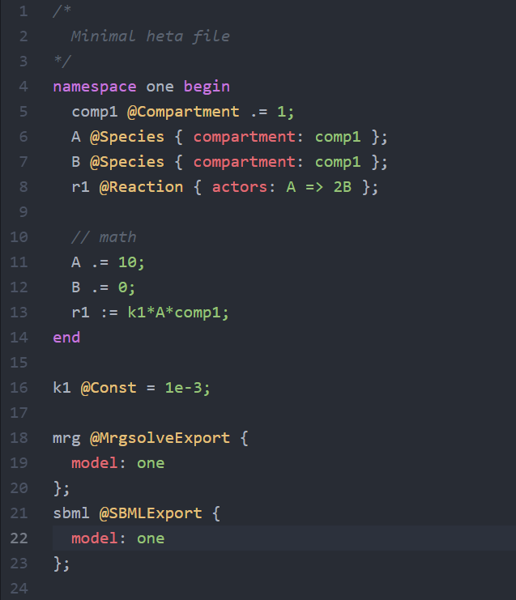

# heta-highlight-atom package

The package is plugin for [Atom](https://atom.io/) editor to highlight Heta language code.

This is part of [heta-lang](https://insysbio.github.io/heta-lang/) project.

## Installation
1) Using Atom menu: **File -> Settings -> Install -> heta**
2) Using apm
```bash
apm install language-heta
```
3) Latest version from github
```bash
apm install insysbio/heta-highlight-atom
```

## Screenshot

